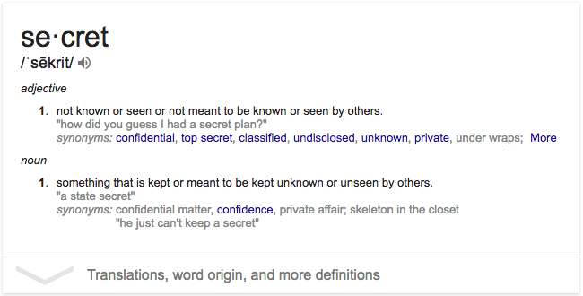

## Introduction to Web Application Development
### Karim Alibhai <!-- .element: class="padded-bottom"  -->

---

## `TODO:`

 - Get to know each other
 - A welcome to the course
 - Your cumulative projects
 - **Lesson 1:** What on Earth is a web app?
 - **Lesson 2:** How Web Servers Chat
 - **Lesson 3:** The Black Screen with the Green Text

---

## Introductions

 - Your name
 - Your current/future career path
 - Something you are passionate about
 - An interesting fact about your passion that the average person wouldn't know

----

## The Catch

 - Everyone will be assigned a random partner.
 - You must introduce your partner, not yourself.

----

<!-- .slide: data-state="timeable" -->
# BEGIN: 00:10:00. <!-- .element: class="timer" -->

----

# TIME'S UP!

---

### Teaching Assistants

 - Diana Dai
 - Farhan Kanjiyani
 - Jeff Peng

---

## Diana Dai

 - Studying Computer Science.
 - I [<3]() _____.
 - `TODO:` interesting fact.

----

## Farhan Kanjiyani ([@farhan5498](https://github.com/farhan5498))

 - Studying Business & Computer Science.
 - I [<3]() Video Games & Technology.
 - `TODO:` interesting fact.

----

## Jeff Peng ([@JeffTheHautbois](https://github.com/JeffTheHautbois))

 - Studying Electrical Engineering.
 - I [<3]() _____.
 - `TODO:` interesting fact.

---

## Teacher
### Karim Alibhai ([@karimsa](gh.alibhai.co))

----

## Who am I?

 - My name is Karim. (?!)
 - I'm a Developer.
 - I [<3]() JavaScript, W3, & teaching.
 - Although JavaScript is a web language, it can be used to create:
    - robots
    - complex AIs
    - mobile & desktop apps

---

# Welcome!

Note:

Thanks for signing up and attending this course.

I hope that everyone has a wonderful experience.

----

## Pace

 - In-class teachings will keep up with class average.
 - TAs are present for the purpose of helping students who would like extra help.
 - TAs as well as the teacher will be available via email outside of class time to answer questions.

----

## Assignments

 - There will be regular assignments to help you learn to properly apply the lessons.
 - All assignments are mandatory.
 - There are supplemental exercises for people that would like extra practice.
 - There are advanced exercises for people that would like to challenge themselves.

----

## Readings & Quizzes

 - There will be regular readings **required** to keep up with the course.
 - There will be **no quizzes**.
 - Whenever possible, we will live code projects together.
    - Every person will be responsible for creating a separate part of the project.
    - Due to this, *if you do not keep up with readings, your **entire** group will suffer.*

---

## Cumulative Project

 - The best practice for a working environment is a working environment.
 - Think of a family member or friend that would benefit from a web application.
 - Either contact this person and ask if you can create it for them,
 - or create it just for fun.

----

## Requirements & Time Spent

 - You may work in pairs of two or alone.
 - There will be time after some classes to work on your projects.
 - You must also work on your projects at home.
 - Try to incorporate as many of the lessons you learn as possible.

----

## The Grand Prize

 - The top 3 projects will receive a *secret grand prize*.

 <!-- .element: class="fragmentize" -->

---

## **Lesson 1:** What on Earth is a web app?

---

## The Layers of a Computer

 - Basic Input and Output System (BIOS) is responsible for communication with all hardware.
 - Operating System (OS) is the software responsible for acting as a host.
    - It runs user-level applications.
    - Provides software known as "drivers" for application to communicate with hardware.
    - Controls the remaining layers.

---

## The Filesystem Layer

 - Filesystem is responsible for long-term data storage and retreival.
 - The hardware behind the filesystem is the hard drive(s).
 - There are two means of data organization:
    - A packet of data is referred to as a `file`.
    - A group of these packets is known as a `directory` (often referred to as a folder).
    - A file *cannot* be within another file, only within a directory.
    - A directory *can* be within another directory.

----

## Notes on the Filesystem

 - The location of a file or directory is referred to as the `path`.
 - Within a path, names of files and directories as separator using a `path separator`.
    - On Unix-based systems, the path separator is `/`. (i.e. `/path/to/my/file.txt`)
    - On Windows, the path separator is `\`. (i.e. `\path\to\my\file.txt`)

----

## Question

 - Given the principles of the filesystem, how would you tell what names belong to files and which ones are directories?
 - For instance: `/a/b/c/d` (name the type for each of the letters).

----

## The Filesystem Tree

 <!-- .element: class="fragmentize" -->

----

## The Filesystem Tree

 - The top-most directory in any OS is referred to as the `root` directory.
 - The name of the directory is not `root`, that is simply what it is referred to as.
 - The name of the root directory is the same as the path separator.
 - When a file or directory is nested in another directory, we can say that it is the child of the other directory.
 - Therefore, the other directory is the parent of this file or directory.

---

## **Lesson 2:** How Web Servers Chat

---

## **Lesson 3:** The Black Screen with the Green Text

---