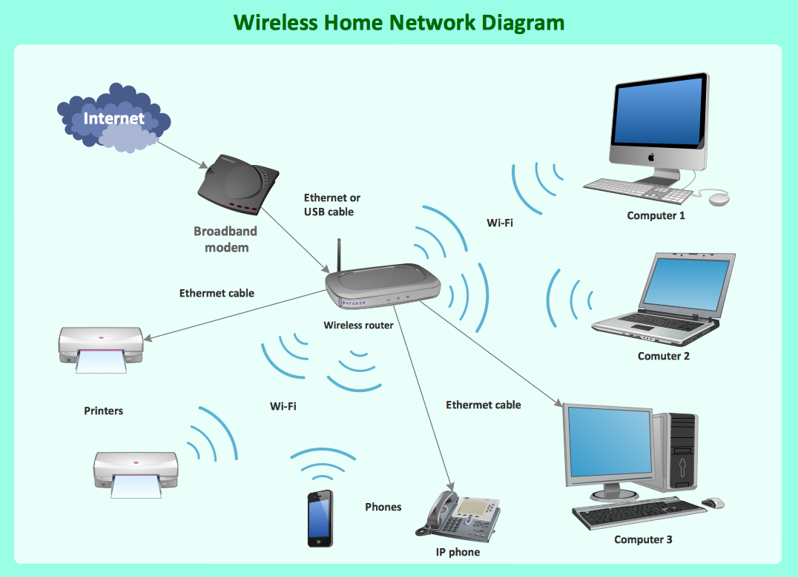

## Introduction to Web Application Development
### Karim Alibhai <!-- .element: class="padded-bottom"  -->

---

## `TODO:`

 - Get to know each other
 - A welcome to the course
 - Your cumulative projects
 - **Lesson 1:** The Insides of a Computer

---

## Introductions

 - Your name
 - Your current/future career path
 - Something you are passionate about
 - An interesting fact about your passion that the average person wouldn't know

----

## The Catch

 - Everyone will be assigned a random partner.
 - You must introduce your partner, not yourself.

----

<!-- .slide: data-state="timeable" -->
# BEGIN: 10:00:00. <!-- .element: class="timer" -->

----

# TIME'S UP!

---

### Teaching Assistants

 - Farhan Kanjiyani
 - Jeff Peng

----

## Farhan Kanjiyani ([@farhan5498](https://github.com/farhan5498))

 - Studying Business & Computer Science.
 - I [<3]() Video Games & Technology.

----

## Jeff Peng ([@JeffTheHautbois](https://github.com/JeffTheHautbois))

 - Studying Electrical Engineering.
 - I [<3]() technology, Ultimate Frisbee, &amp; the Oboe.

---

## Teacher
### Karim Alibhai ([@karimsa](gh.alibhai.co))

----

## Who am I?

 - My name is Karim. (?!)
 - I'm a Developer.
 - I [<3]() JavaScript, W3, & teaching.

---

# Welcome!

Note:

Thanks for signing up and attending this course.

I hope that everyone has a wonderful experience.

----

## Pace

 - This is not a class about programming, it's about concepts.
 - In-class teachings will keep up with class average.
 - TAs are present for the purpose of helping students who would like extra help.
 - TAs as well as the teacher will be available via email outside of class time to answer questions.

----

## Assignments

 - There will be regular assignments to help you learn to properly apply the lessons.
 - There are supplemental exercises for people that would like extra practice.
 - There are advanced exercises for people that would like to challenge themselves.

----

## Readings & Quizzes

 - There will be regular readings **required** to keep up with the course.
 - There will be **no quizzes**.
 - Whenever possible, we will live code projects together.
    - Every person will be responsible for creating a separate part of the project.
    - Due to this, *if you do not keep up with readings, your **entire** group will suffer.*

---

## Cumulative Project

 - The best practice for a working environment is a working environment.
 - Think of a family member or friend that would benefit from a web application.
 - Either contact this person and ask if you can create it for them...
 - ... or create it just for fun.

----

## Requirements & Time Spent

 - You may work in pairs of two or alone.
 - There will be time after some classes to work on your projects.
 - You must also work on your projects at home.
 - Try to incorporate as many of the lessons you learn as possible.

----

## The Grand Prize

 - The top 3 projects will receive a *secret grand prize*.

 <!-- .element: class="fragmentize" -->

---

## **Lesson 1:** The Insides of a Computer

---

## The Layers of a Computer

 - Basic Input and Output System (BIOS) is responsible for communication with all hardware.
 - Operating System (OS) is the software responsible for acting as a host.
    - Provides software known as `drivers` for application to communicate with hardware.
    - Controls the remaining layers.

---

## The Filesystem Layer

 - Filesystem is responsible for long-term data storage and retreival.
 - The hardware behind the filesystem is the hard drive(s).
 - There are two means of data organization:
    - A packet of data is referred to as a `file`.
    - A group of these packets is known as a `directory` (often referred to as a folder).
    - A file *cannot* be within another file, only within a directory.
    - A directory *can* be within another directory.

----

## Notes on the Filesystem

 - The location of a file or directory is referred to as the `path`.
 - Within a path, names of files and directories are separated using a `path separator`.
    - On Unix-based systems, the path separator is `/`. (i.e. `/path/to/my/file.txt`)
    - On Windows, the path separator is `\`. (i.e. `\path\to\my\file.txt`)

----

## Question Time: Which is which?

 - Given the principles of the filesystem, how would you tell what names belong to files and which ones are directories?
 - For instance: `/a/b/c/d` (name the type for each of the letters).

---

## Multiple Hard Drives

 - Every HDD has its own filesystem.
 - On Windows, all drives are assigned a letter which preceeds every path (followed by a colon).
  - The default drive is always the `C` drive.
  - For example: `C:\Users\Administrator`
 - On Unix, all drives are `mounted` onto a directory.
  - For example: `/mnt/My-USB` or `/Volumes/My-USB`

----

## Special Cases

 - Windows filesystems are NOT case sensitive.
  - Therefore, `\users` is the same thing as `\Users`.
 - *nix filesystems are case sensitive.
  - Therefore, `/Users` and `/users` are `NOT` the same thing.
 - You should try to avoid using uppercase characters or whitespaces in paths
  - Whitespaces in paths must be escaped using a backslash on *nix.
  - For example: `/my directory` is an invalid path; `/my\ directory` is a valid path.
 - Valid path characters change based on the filesystem implementation.

---

## The Filesystem Tree

 - The top-most directory in any OS is referred to as the `root` directory.
 - The name of the directory is not `root`, that is simply what it is referred to as.
 - The name of the root directory is the same as the path separator.
 - When a file or directory is nested in another directory, we can say that it is the child of the other directory.
 - Therefore, the other directory is the parent of this file or directory.

----

## The Filesystem Tree

 <!-- .element: class="fragmentize" -->

---

## Relative & Absolute Paths

 - Paths can be either relative or absolute.
 - Within any directory, there are two special directories:
  - `.`: represents the current directory.
  - `..`: represents the parent directory.
 - Absolute paths define the location of a file/directory from the root of the filesystem.
 - Relative paths define the location of a file/directory relative to the current directory or a specific file.

----

# [Practice](http://goo.gl/forms/iTmQtvhgiFaFityK2)

----

## File Extensions

 - Within a filename, the actual name of the file and its extension are separated by a period.
 - The file extension tells the OS and the user what type of file it is.
 - Popular file extensions:
    - Image files: jpeg, jpg, png, gif.
    - Video files: avi, mp4, mov.
    - Text files: .txt
    - Executables: .exe (windows-only)
 - On Linux, file extensions are not necessary.

---

## The User & Groups Layer

 - The OS mananges a list of users &amp; groups.
 - All users and groups have specific permissions within the OS.
 - All files &amp; directories have owners that set read, write, and execute permissions.
 - The users with the highest privileges are root users (on Unix systems) and administrators (on Windows).
 - Some admins must provide their password before executing any admin-level functions (i.e. deleting protected files).

---

## The Networking Layer

 - Responsible for inter-device communication.
 - Underlying *internal* hardware is known as the Network Interface Card (NIC).
 - Networking involves much *external* hardware as well.

----

## Internet Protocol Address

 - An IP address is an address of a device on a network.
 - The format of an IP address is predefined.
 - IPv4 addresses (most common) format: four groups of decimal digits (8 bit groups).
  - For example: 192.168.1.101
 - IPv6 address format: eight groups of four hexadecimal digits (16 bit groups).
  - For example: 2001:0db8:85a3:0000:0000:8a2e:0370:7334

----

## The Router

 - Creates a local network for inter-device communication for all connected devices.
 - Manages communication between local network and the internet.
 - For devices, communication on the local network and devices on the internet is almost identical.
 - Assigns a local IP address to all devices, including itself.
 - Routers have a local IP **and** a public IP.

----

## The Local Area Network (LAN + WLAN)

 <!-- .element: style="width: 500px;" -->

----

## Ports

 - There are 65536 (or 2^16) `ports` on any given device.
 - Ports are where all data between devices are sent from and to.
 - Ports are specified by integers. (i.e. the first port is 1, the last is 65536)
 - Ports < 1024 can only be opened by applications with administrative access.
 - There are two main protocols which can be used to network: TCP &amp; UDP.

----

## User Datagram Protocol (UDP)

 - Known as a `best-effort` protocol.

 <!-- .element: class="fragmentize" -->

----

### Transmission Control Protocol (TCP)

 - Requires an on-going connection between hosts.
 - Each host must continuously acknowledge received and sent data.
 - This keeps both hosts up-to-date on each other's presence.

 <!-- .element: class="fragmentize" -->

----

## Question Time: What protocol should be used for each?

 - A chatting application.
 - Device discovery.
 - Video streaming.
 - Internet audio/video calling.

---

## Notes on Networking

 - For a device to receive data over a network, it must have an application that binds onto a port.
 - For a device to send data over a network, it needs the IP address and port of the receiver.

----

## Public Routing

 - When communicating with devices over the internet, you specify the external device's router's public IP.
 - The router then forwards (or *routes*) the connection through to the device on the LAN.
 - But what about when IP addresses change? And aren't IPs too complicated for users to specify?

----

### Domain Name System (DNS)

 - DNS is responsible for resolving domain names to IP addresses.
 - Domain names are alpha numeric names that can be bought from Domain Registrars.
 - There are only a set number of top-level domains. (i.e. `com`, `ca`, `org`, `co`)
 - Your domain name must have a top-level domain attached to it.
 - Your domain may have as many sub-domains as you would like (i.e. `images`.google.com, `docs`.google.com)
 - Your sub-domains can have sub-domains. (i.e. `scontent`.xx.fbcdn.com)

----

## Designs of a Networking App

 - Server-Client: a server awaits connections, a client connects to the server.
 - Peer-to-Peer (P2P): peer discovers other peers. Everyone is a client and a server.
 - Both are protocol-independent.
 - The trade-off:
  - P2P offers a better connection as the number of clients increases.
  - Server-client offers the security of a central authority.

----

## The Ends of an App

 - `Front-end` is the part of the application that the users sees and interacts with.
 - `Back-end` is the part of the application that runs on the server.

---

## The Application Layer

 - Recall: the OS serves as a host.
 - The OS allows code to run on the machine at a higher level than the OS.
  - Heirgo, the OS *hosts* applications.
  - The OS provides programmable interfaces through which applications can access low-level functions. 
 - Applications that run directly on top of the OS are known as `native` applications.

----

## Programming

 - In reality, computers can only execute machine code.
 - The process of compiling involves a program known as a compiler.
    - A compiler reads some code and writes the corresponding machine code.
 - All programming languages compile down to machine code.
 - During compilation, an appropriate executable is generated.
 - These languages are also known as `compile-time languages`.

----

## Native Apps

 - Have direct access to all interfaces that the OS allows.
 - Are written in a *programming* language that `compiles` into machine code.
  - Therefore, the code runs **directly** on the machine.
 - Must be compiled for every architecture (i.e. windows, linux, and darwin - possibly with 32bit and 64bit versions)
 - Require the user to provide administrative privileges for particular functions to be performed.

----

## Languages on Languages

 - Some programming languages are built to compile to other languages.
 - These languages are rewritten into their lower-level cousins during compilation.
 - The outputted code is then compiled into machine code.
 - For example:
  - C and C++ are translated to Assembly on compilation.
  - CoffeeScript and TypeScript are translated to JavaScript on compilation.

----

## Languages that Don't Compile

 - Some languages are not compiled, they are interpreted.
 - There is a `run-time` responsible for reading the language and dispatching the appropriate actions.
 - These languages are known as:
  - interpreted
  - scripting languages
  - run-time languages
 - JavaScript is interpreted top to bottom.
 - "*Java* is to *Java*Script as *Car* is to *Car*pet."

----

## Languages that aren't Languages

 - Markup languages are not programming languages.
 - Markup does not dispatch any actions, it defines things.
 - For example:
  - Markdown: defines the style of sections of text.
  - YAML: like a big tree of data.
  - HTML: defines the elements of a web page.